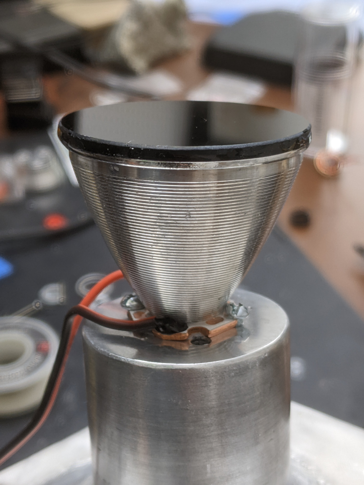
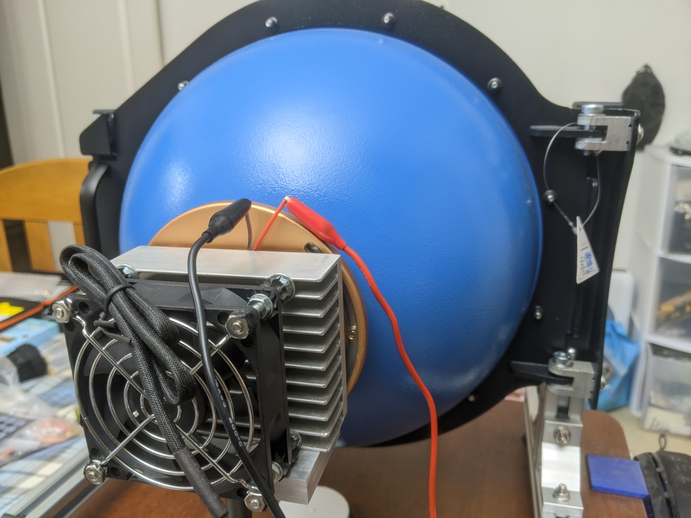
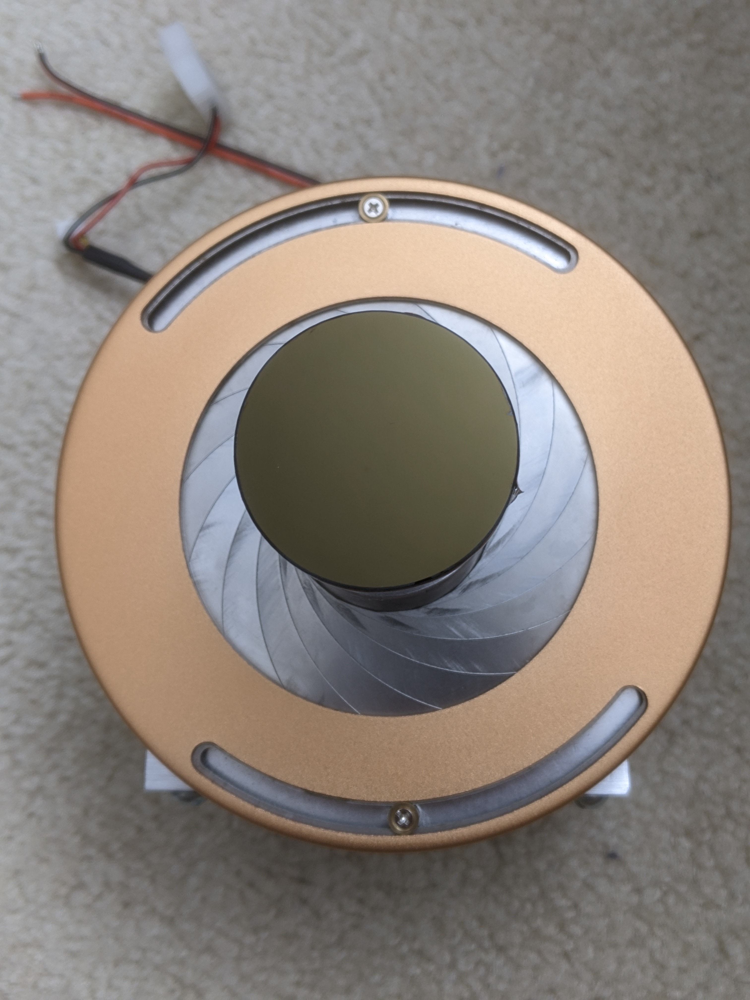

# Experiment Details
In this experiment, a dichroic lens was tested to determine solarization over a course of 100+ hours. Measurements were taken every 10 minutes. A UV transmitting adhesive was used to ensure as little loss as possible between components.

## LED used
Photonwave 257nm PKB-H50-F35 run at 5.9V/500mA

## Equipment used
- HOPOOCOLOR OHSP-350MUV
- HOPOOCOLOR BaSO4 coated integrating sphere
- 42mm dichroic lens
- Convoy C8 smooth reflector

## Methods and Limitations
- The LED was attached to a reflector which then connected to the dichroic lens (pictured below), as it would be in the use case of a flashlight.
- Equipment was set up in an integrating sphere (pictured below) to measure total light output as the lens solarized and to allow for automated testing. However, this means increased wear and tear on the lens as the UV light bounces back and hits the lens again
- An adjustable iris (pictured below) was used to close off gaps between the integrating sphere and equipment. While the iris reflected UV, it was not coated in the same coating as the integrating sphere
- There was an equipment failure due to a short power outage leading to several hours of blank data. However, this only affected the UV light source. The spectroradiometer was connected to an external power supply and continued recording data until power was restored to the UV LED.

## Photos of setup

